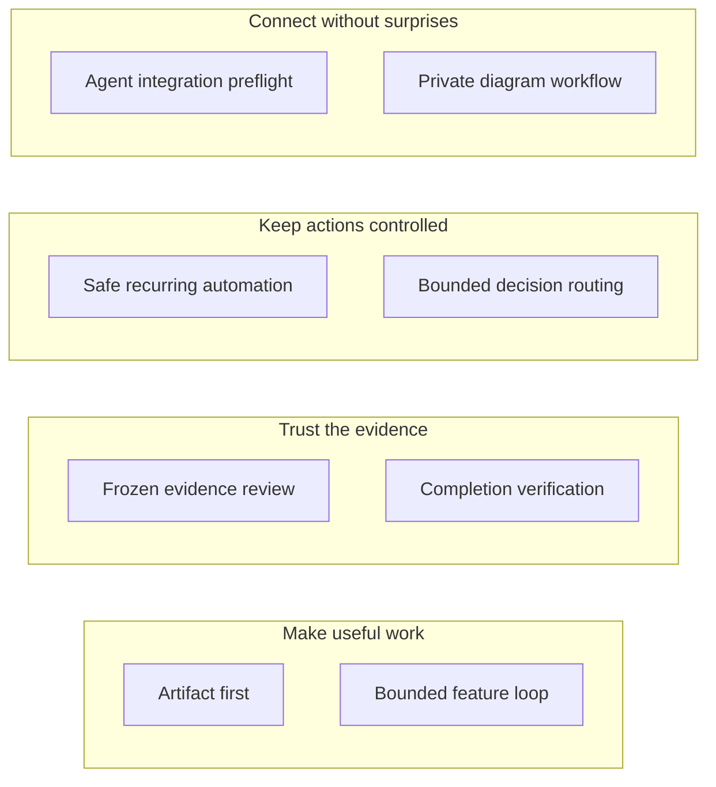

# Pache-Skills

Eight practical procedures for agents, by Pachecodes / Jesus Pacheco / Akitá Labs.
Use them to make work easier to inspect, safer to bound, and harder to call finished too early.

**Skills are written procedures, not an autonomous app.** They do not run a service,
create a sandbox, grant approval, install a vendor plugin, or replace agent policy.
No client artifacts, upstream skill library, vendor adapters, media, or credentials are included in the skill pack.

## Who this is for

For developers delegating a small change, reviewers checking evidence, and operators
planning recurring tasks or connecting an agent interface. You need an instruction-following
agent and authorized tools; these documents do not supply missing execution capabilities.



Eight independent procedures, not a required execution order. The explanations below
are the text equivalent; [editable overview source](docs/assets/skill-overview.md) is also available.

## The eight skills

Each name links to its full procedure. The examples below are requests you can adapt,
not commands that run on their own. Read the prerequisites and authority limits first.

### 1. [pache-artifact-first](skills/pache-artifact-first/SKILL.md)

Turn an explanation or decision into the smallest useful deliverable: a clear guide,
a diagram, or a working comparison. Produce editable source and check the actual output;
a screenshot or unrendered source is not a substitute for the requested artifact.

**Example:** “Build a local page comparing three synthetic pricing options; test invalid
inputs and keyboard controls, and do not publish it.”

### 2. [pache-bounded-feature-loop](skills/pache-bounded-feature-loop/SKILL.md)

Fix one reproducible bug or implement one feature with fixed acceptance checks and a stop budget.
Separate the implementer from the reviewer where tools allow it, preserve unrelated changes,
and stop rather than weakening tests or silently extending the repair budget.

**Example:** “Fix the empty-search crash in an isolated worktree; reproduce it first,
allow at most two repairs, and leave merging and deployment disabled.”

### 3. [pache-frozen-evidence-review](skills/pache-frozen-evidence-review/SKILL.md)

Check that a review and its test results refer to the exact same, no-longer-changing files.
Record file fingerprints and evaluator identity, run checks against those bytes, and label
whether the evidence is inspection, repeated maker tests, or independently designed checks.

**Example:** “Review this read-only candidate; match the test receipt to its file hashes
and report which cases were skipped, without changing the source.”

### 4. [pache-safe-recurring-automation](skills/pache-safe-recurring-automation/SKILL.md)

Plan repeating work with an explicit owner, permitted actions, deadline, and stop condition.
Keep progress outside the chat, avoid processing the same event twice, and notify only on
meaningful changes. Installing the procedure does not create or start a scheduled job.

**Example:** “Design a read-only build watcher that reports changed verdicts, remembers
processed events, and stops at its deadline; do not start or persist it.”

### 5. [pache-completion-verification](skills/pache-completion-verification/SKILL.md)

Check what actually happened before accepting a worker's ‘done’ or a successful write response.
Read the final artifact and, for authorized external writes, read back the exact target.
After a timeout, reconcile the existing state before retrying an action that could duplicate work.

**Example:** “Check this worker's acceptance criteria and inspect the exact record after
its timed-out update; report unknowns without retrying or making new changes.”

### 6. [pache-bounded-decision-routing](skills/pache-bounded-decision-routing/SKILL.md)

Compare a finite set of workflow choices against simple rules using labeled examples.
Test recommendations offline, then in shadow mode—observe without changing live behavior.
Allow ‘none’ when uncertain; a recommendation never grants permission to act.

**Example:** “Compare a router choosing documentation, code, or abstain against a rule
baseline on labeled cases; keep current routing and permissions unchanged.”

### 7. [pache-agent-integration-preflight](skills/pache-agent-integration-preflight/SKILL.md)

Audit an IDE, desktop interface, or companion device before attaching it to an agent runtime.
Check the actual runtime/profile, launch permissions, settings ownership, telemetry, and
harmless session evidence; a connected badge alone does not prove the intended connection.

**Example:** “Audit this IDE attachment read-only; identify its runtime and effective
permission mode without installing plugins, changing settings, or pairing devices.”

### 8. [pache-private-diagram-workflow](skills/pache-private-diagram-workflow/SKILL.md)

Draw relationships supported by evidence while keeping diagram source private when required.
Use a vetted local/private renderer, retain editable source and a text equivalent, and inspect
labels and arrows. A public renderer receives source; an encoded share link is not encryption.

**Example:** “Diagram these generic components with an available local renderer; mark
proposed links, inspect the rendered output, and send nothing to a public service.”

## Preview first; install only by choice

**Trust first:** read the selected procedure, [provenance](PROVENANCE.md),
[security guidance](SECURITY.md), and bundled scripts. Python 3.10+ is required for tooling.
From the repository root, validate and preview copies into a destination you explicitly choose:

```sh
python3 scripts/validate.py
python3 scripts/install.py --dest <chosen-skills-directory> --skill pache-artifact-first
```

The destination placeholder must be replaced; determine it from your runtime's current docs.
Preview does not copy files. Add `--apply` only after approving the displayed destinations.
**No overwrites, default directory, deletion, global configuration, scheduler, or hooks.**
Use a disposable destination first, not a real home for testing. Inspect any copied files;
a successful copy is not proof of automatic discovery or runtime acceptance.

## Guides and evidence

- [Installation](docs/installation.md): selection, preview, explicit apply, and manual removal.
- [Capabilities](docs/capabilities.md): prerequisites, tool mapping, and honest blockers.
- [Compatibility](docs/compatibility.md): Hermes, Claude Code, and Codex adaptation limits.
- [Verification](docs/verification.md): local tests, privacy checks, and release limitations.
- [Catalog and prompts](CATALOG.md) · [Provenance](PROVENANCE.md) · [Contributing](CONTRIBUTING.md).

Privacy checks are heuristic, not proof of anonymity or legal ownership. Passing the validator
is not release approval; independent content, privacy, and provenance review remain required.
License: [MIT original pack content](LICENSE); no rights to excluded sources or runtimes are implied.
